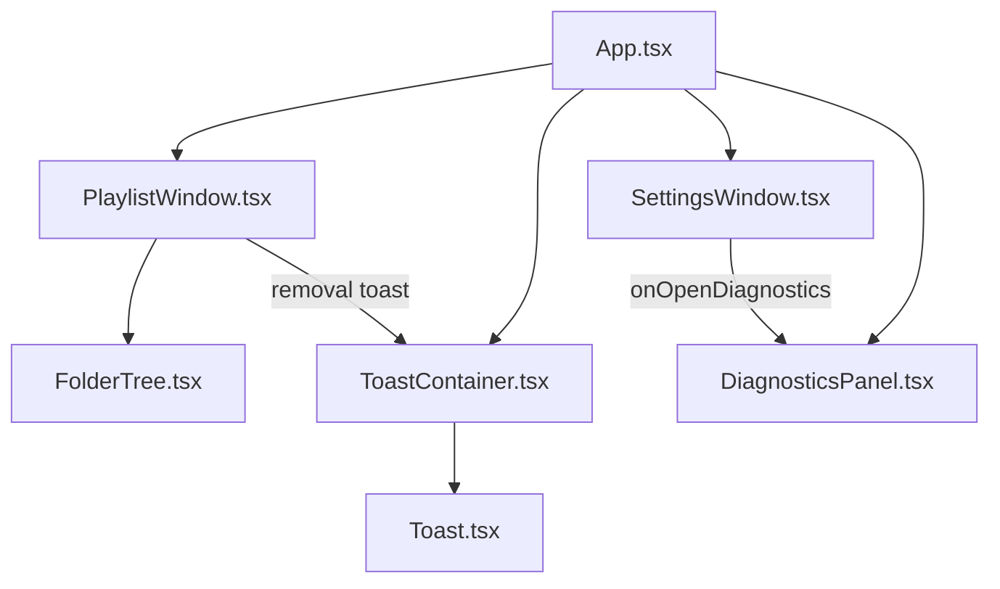

# Design Document: Settings Page Redesign

## Overview

This design covers the redesign of two major UI surfaces in SlideShowBob: the Settings panel and the Playlist panel. The goal is to improve information architecture, navigation, terminology, and interaction patterns while maintaining the existing glassmorphism dark theme.

**Settings Panel** changes:
- Reorganize the flat settings list into three navigable sections: Playback, Display, and Persistence
- Add a section navigation sidebar (vertical tab list) for direct section access
- Replace eight individual "remember" toggles with a master toggle + opt-out model
- Rename developer-facing labels to user-friendly terminology with inline descriptions
- Relocate the diagnostics link to a subtle bug icon in the lower-left corner
- Remove the manifest download action from settings (out of scope for this panel)
- Add explicit Save/Cancel footer with dirty-state tracking

**Playlist Panel** changes:
- Simplify the header into a clean single row (title + count, search, view toggle, close)
- Move folder/filter actions into a dedicated toolbar row below the header
- Consolidate to a single "Add Folder" button in the toolbar (remove sidebar duplicate)
- Add media-type icons and subfolder grouping to the file list view
- Increase thumbnail grid card sizes (min 140px) and font sizes (12px+ names, 11px+ indices)
- Replace the blocking confirmation dialog with a toast+undo pattern for file removal, and an inline confirmation for folder removal
- Enhance the folder sidebar with tree-line connectors, expanded/collapsed icons, accent-colored selection, and hover-reveal remove actions

## Architecture

The redesign modifies existing React components without introducing new architectural patterns. The component hierarchy remains:



**Key architectural decisions:**

1. **Section navigation via vertical tab list** — The settings panel uses a left-aligned vertical nav (`role="tablist"` with `aria-orientation="vertical"`) that controls which section is visible. Each section is a `role="tabpanel"`. This avoids scroll-based navigation complexity and provides clear keyboard semantics.

2. **Settings state remains in SettingsWindow** — The component already manages a local `AppSettings` copy with dirty tracking. The redesign restructures the JSX layout but keeps the same state management pattern: load on mount, track changes via `hasChanges`, save/cancel in footer.

3. **Toast with undo for removal** — The existing `useToast` hook and `Toast`/`ToastContainer` components are extended to support an optional action button (undo). The `Toast` interface gains an optional `action` field. This keeps the removal flow non-blocking while providing a recovery path.

4. **Inline folder removal confirmation** — Instead of a full-screen overlay dialog, folder removal shows a small inline confirmation within the folder sidebar row itself, replacing the folder name temporarily with "Remove? Yes / No" text.

5. **CSS-only tree-line connectors** — The folder sidebar tree uses `::before` pseudo-elements on child items to draw vertical and horizontal connector lines, avoiding any additional DOM elements or SVG.

## Components and Interfaces

### SettingsWindow.tsx (Modified)

```typescript
// New internal types
type SettingsSection = 'playback' | 'display' | 'persistence';

// Component state additions
const [activeSection, setActiveSection] = useState<SettingsSection>('playback');
```

**Layout structure:**
```
┌─────────────────────────────────────────┐
│  Settings                          [×]  │
├──────────┬──────────────────────────────┤
│ Playback │  Section content area        │
│ Display  │  (renders active section)    │
│ Persist  │                              │
│          │                              │
│          │                              │
│ 🐛       │                              │
├──────────┴──────────────────────────────┤
│                      [Cancel]  [Save]   │
└─────────────────────────────────────────┘
```

- The section nav is a `<nav role="tablist" aria-orientation="vertical">` with `<button role="tab">` elements
- Each section is a `<div role="tabpanel">` shown/hidden based on `activeSection`
- The diagnostics bug icon sits at the bottom of the nav column, absolutely positioned within the nav area
- The footer Save/Cancel buttons remain unchanged in behavior

**Playback section controls:**
- Transition Style (select) — renamed from "Transition Effect"
- Slide Timing (range/number input for delay)
- Include Videos (toggle)
- Sort Order (select) — renamed from "Sort Mode"
- Mute Audio (toggle) — renamed from "Mute State"

**Display section controls:**
- Background Blur (toggle)
- Scale to Fit (toggle) — renamed from "Fit to Window"
- Zoom Level (range slider)

**Persistence section controls:**
- Master toggle: "Remember My Settings"
- When enabled: individual opt-out toggles for each preference (slide delay, include videos, sort order, mute audio, scale to fit, zoom level, transition style, loaded folders)
- When disabled: individual toggles hidden

### PlaylistWindow.tsx (Modified)

**Layout structure:**
```
┌─────────────────────────────────────────────┐
│ Playlist (42 items)  [search] [≡][⊞]  [×]  │  ← Header row
├─────────────────────────────────────────────┤
│ [Show All]  [+ Add Folder]                  │  ← Toolbar row
├──────────┬──────────────────────────────────┤
│ Folders  │  File list / Thumbnail grid      │
│ 📁 Root  │  🖼️ image1.jpg                   │
│  └📁 Sub │  🎬 video1.mp4                   │
│          │                                  │
└──────────┴──────────────────────────────────┘
```

- Header: title with count, search input, view mode toggle, close button — single row
- Toolbar: "Show All" button (when folder filter active), "Add Folder" button
- Sidebar header: "Folders" label only (no duplicate add button)
- File list: media-type icon (🖼️/🎬) replaces numeric index, 14px+ font, subfolder grouping headers, accent left-border for current item, hover-reveal actions
- Thumbnail grid: min 140px card width, 12px gap, 12px file name font, 11px index font, 2-line name with ellipsis
- Removal: immediate remove + toast with undo (5s auto-dismiss) for files; inline confirmation for folders

### Toast.tsx (Modified)

```typescript
export interface Toast {
  id: string;
  message: string;
  type: ToastType;
  duration?: number;
  action?: {           // NEW
    label: string;
    onClick: () => void;
  };
}
```

The Toast component renders an optional action button next to the close button when `action` is present. The action button uses the accent color and calls `action.onClick` then dismisses the toast.

### useToast.ts (Modified)

```typescript
// Extended showToast signature
const showToast = useCallback((
  message: string,
  type: Toast['type'] = 'info',
  duration?: number,
  action?: { label: string; onClick: () => void }
) => { ... }, []);
```

### FolderTree.tsx (Modified)

- Add tree-line connector CSS classes (`folder-tree-connector-vertical`, `folder-tree-connector-horizontal`)
- Use distinct icons for expanded (📂) vs collapsed (📁) folders
- Apply accent color background on selected folder row
- Show file count badge next to folder name
- Hover-reveal remove button (already exists, keep behavior)

### settingsStorage.ts (Modified)

```typescript
export interface AppSettings {
  // ... existing fields ...
  masterPersistenceEnabled: boolean;  // NEW — master toggle state
}
```

When `masterPersistenceEnabled` is `false`, `saveSettings` skips writing any preference values (only saves the master toggle state itself and individual flags). When `true`, it respects individual `save*` flags as before.

## Data Models

### AppSettings (Extended)

```typescript
export interface AppSettings {
  // Playback
  slideDelayMs: number;
  includeVideos: boolean;
  sortMode: 'NameAZ' | 'NameZA' | 'DateOldest' | 'DateNewest' | 'Random';
  isMuted: boolean;
  transitionEffect: TransitionEffect;

  // Display
  isFitToWindow: boolean;
  zoomFactor: number;
  backgroundBlur: boolean;

  // Persistence
  masterPersistenceEnabled: boolean;  // NEW
  saveSlideDelay: boolean;
  saveIncludeVideos: boolean;
  saveSortMode: boolean;
  saveIsMuted: boolean;
  saveIsFitToWindow: boolean;
  saveZoomFactor: boolean;
  saveTransitionEffect: boolean;
  saveFolders: boolean;
}
```

Default: `masterPersistenceEnabled: true` (all preferences remembered by default).

### Toast (Extended)

```typescript
export interface Toast {
  id: string;
  message: string;
  type: 'success' | 'error' | 'info' | 'warning';
  duration?: number;
  action?: {
    label: string;
    onClick: () => void;
  };
}
```

### FolderNode (Unchanged)

The existing `FolderNode` interface from `src/utils/folderTree.ts` is sufficient. No data model changes needed for tree-line connectors (CSS-only) or icon changes (render logic only).

### Removal Undo State (PlaylistWindow internal)

```typescript
interface PendingUndo {
  type: 'file';
  item: MediaItem;
  originalIndex: number;
  toastId: string;
}
```

When a file is removed, the component stores the removed item and its original index. If the user clicks "Undo" on the toast, the item is re-inserted at `originalIndex`. The `toastId` links the undo state to the specific toast so it can be cleaned up on auto-dismiss.

### Folder Inline Confirmation State (PlaylistWindow internal)

```typescript
// Replaces the current pendingRemove state
const [pendingFolderRemove, setPendingFolderRemove] = useState<string | null>(null);
// string = folder name being confirmed, null = no confirmation active
```

This replaces the current `pendingRemove` state and full-screen overlay dialog with a simpler inline pattern.


## Correctness Properties

*A property is a characteristic or behavior that should hold true across all valid executions of a system — essentially, a formal statement about what the system should do. Properties serve as the bridge between human-readable specifications and machine-verifiable correctness guarantees.*

### Property 1: Section navigation displays correct content and active state

*For any* settings section (Playback, Display, Persistence), activating that section in the Section_Nav should display the corresponding section panel, mark the activated nav item as active (with the appropriate CSS class or aria-selected attribute), and keep the Section_Nav visible.

**Validates: Requirements 2.2, 2.3, 2.4**

### Property 2: All setting controls have descriptive text

*For any* setting control rendered in the Settings_Panel, there should be a plain-language description element (text node or element with a description class) associated with the control's label, explaining what the setting does.

**Validates: Requirements 3.5**

### Property 3: Master persistence toggle controls individual toggle visibility

*For any* state of the master "Remember My Settings" toggle, the individual preference opt-out toggles should be visible when the master toggle is enabled and hidden when the master toggle is disabled.

**Validates: Requirements 4.3**

### Property 4: Individual persistence toggles control what is persisted

*For any* combination of individual persistence toggle states (with master toggle enabled), saving settings and then loading them should return the saved values only for preferences whose individual toggle was enabled, while preferences with disabled toggles should revert to defaults.

**Validates: Requirements 4.5**

### Property 5: Settings save round trip

*For any* valid set of AppSettings values, saving the settings and then loading them should produce an equivalent settings object (for all preferences that have their persistence toggle enabled).

**Validates: Requirements 8.3**

### Property 6: Settings cancel discards changes

*For any* set of unsaved changes to settings, activating "Cancel" should result in the persisted settings remaining identical to what they were before the changes were made.

**Validates: Requirements 8.4**

### Property 7: Settings keyboard navigation

*For any* position in the Section_Nav tab list, pressing the down arrow key should move focus to the next tab, and pressing the up arrow key should move focus to the previous tab, wrapping at boundaries.

**Validates: Requirements 7.1**

### Property 8: Settings focus trapping

*For any* focusable element within the Settings_Panel modal, pressing Tab from the last focusable element should wrap focus to the first focusable element, and Shift+Tab from the first should wrap to the last.

**Validates: Requirements 7.4**

### Property 9: Settings ARIA attributes

*For any* interactive element in the Settings_Panel (nav items, toggles, buttons, sections), the element should have the appropriate ARIA role and accessible label (role="tablist" for nav, role="tab" for nav items, role="tabpanel" for sections, aria-label or aria-labelledby for controls).

**Validates: Requirements 7.3**

### Property 10: File list media-type icons

*For any* media item in the Playlist_File_List, the rendered row should display a media-type icon that corresponds to the item's MediaType (image icon for Image type, video icon for Video type, gif icon for Gif type) instead of a plain numeric index.

**Validates: Requirements 11.1**

### Property 11: Current file highlighting

*For any* playlist and any valid current index, the file list item at that index should have the "current" CSS class applied, and no other item should have that class.

**Validates: Requirements 11.4**

### Property 12: File removal with toast and no dialog

*For any* file in the playlist, removing it should immediately decrease the playlist length by one, not render a confirmation dialog overlay, and display a toast notification containing the removed file's name and an "Undo" action button.

**Validates: Requirements 13.1, 13.2**

### Property 13: File removal undo round trip

*For any* file at any position in the playlist, removing the file and then activating "Undo" on the resulting toast should restore the file to its original position, leaving the playlist identical to its state before removal.

**Validates: Requirements 13.3**

### Property 14: Folder node rendering

*For any* FolderNode in the folder tree, the rendered output should: display an expanded icon (📂) when `isExpanded` is true and a collapsed icon (📁) when false; apply the accent-colored selected background class when the folder is the currently selected folder; and display the folder's `fileCount` value next to the folder name.

**Validates: Requirements 14.1, 14.2, 14.3**

### Property 15: Playlist focus trapping

*For any* focusable element within the Playlist_Panel modal, pressing Tab from the last focusable element should wrap focus to the first focusable element, and Shift+Tab from the first should wrap to the last.

**Validates: Requirements 15.1**

### Property 16: Playlist ARIA attributes

*For any* interactive element in the Playlist_Panel (folder tree, file list, thumbnail grid, buttons), the element should have the appropriate ARIA role and accessible label.

**Validates: Requirements 15.3**

### Property 17: Playlist list and grid keyboard navigation

*For any* position in the Playlist_File_List or Playlist_Thumbnail_Grid, pressing the down arrow key should move focus to the next item, and pressing the up arrow key should move focus to the previous item.

**Validates: Requirements 15.4**

## Error Handling

### Settings Save Failures

When `localStorage.setItem` throws (quota exceeded, storage disabled), the Settings_Panel:
1. Catches the error in the existing `saveSettings` try/catch
2. Displays an error toast via `showError("Unable to save settings. Changes may not persist.")`
3. Keeps the modal open so the user can retry or cancel
4. The in-memory settings state remains applied for the current session

This matches the existing error handling in `settingsStorage.ts` — no new error paths are introduced.

### Settings Load Failures

When `localStorage.getItem` fails or returns corrupt JSON:
1. The existing `loadSettings` function falls back to `defaultSettings`
2. Shows a warning toast once: "Saved settings could not be loaded. Defaults were restored."
3. Clears the corrupted data from localStorage

The new `masterPersistenceEnabled` field defaults to `true` via the spread with `defaultSettings`, so missing fields in old stored data are handled gracefully.

### File Removal Undo Edge Cases

- If the user removes a file and the undo timer expires (5s), the `PendingUndo` state is cleared and the removal is permanent
- If the user removes another file before undoing the first, the first removal becomes permanent (only one pending undo at a time)
- If the playlist is modified between removal and undo (e.g., folder added), the file is re-inserted at `Math.min(originalIndex, playlist.length)` to avoid out-of-bounds

### Folder Removal Inline Confirmation

- If the user clicks away from the inline confirmation, it dismisses (sets `pendingFolderRemove` to null)
- If the user presses Escape while inline confirmation is shown, it dismisses the confirmation (not the modal)
- Only one folder confirmation can be active at a time

### Toast Action Cleanup

- When a toast with an undo action auto-dismisses, the associated `PendingUndo` state is cleaned up
- The `removeToast` callback in `useToast` is extended to accept an optional cleanup callback that runs on dismissal

## Testing Strategy

### Unit Tests

Unit tests cover specific examples, edge cases, and structural checks:

- **Settings structure**: Verify the three sections exist with correct names, default section is Playback, correct controls in each section
- **Label renaming**: Verify specific labels ("Transition Style", "Mute Audio", "Scale to Fit", "Sort Order")
- **Master toggle defaults**: Verify master toggle defaults to enabled with all preferences on
- **Master toggle show/hide**: Verify individual toggles visible when master on, hidden when master off
- **Diagnostics icon**: Verify bug icon exists in lower-left, has tooltip "Diagnostics", has aria-label "Open diagnostics", triggers onOpenDiagnostics + onClose on click
- **Save/Cancel buttons**: Verify footer has Save and Cancel, Save disabled when no changes
- **Escape key**: Verify Escape closes settings without saving, Escape closes playlist
- **Focus on open**: Verify settings focuses first interactive element, playlist focuses search input
- **Playlist header structure**: Verify header contains title+count, search, view toggle, close only
- **Playlist toolbar**: Verify toolbar contains Show All and Add Folder
- **Single Add Folder**: Verify exactly one Add Folder button exists
- **Subfolder grouping**: Verify group headers appear in file list when showing all files
- **Toast auto-dismiss**: Verify removal toast dismisses after 5 seconds
- **Folder inline confirmation**: Verify folder removal shows inline prompt, not overlay dialog
- **Save failure**: Verify error toast shown and modal stays open on save failure

### Property-Based Tests

Property-based tests use `fast-check` (already in devDependencies) with minimum 100 iterations per test. Each test references its design document property.

- **Feature: settings-page-redesign, Property 1: Section navigation displays correct content and active state** — Generate random section selections, verify correct panel shown and nav item active
- **Feature: settings-page-redesign, Property 2: All setting controls have descriptive text** — Generate random section views, verify all controls have descriptions
- **Feature: settings-page-redesign, Property 3: Master persistence toggle controls individual toggle visibility** — Generate random master toggle states, verify individual toggle visibility matches
- **Feature: settings-page-redesign, Property 4: Individual persistence toggles control what is persisted** — Generate random toggle configurations, save, load, verify correct subset persisted
- **Feature: settings-page-redesign, Property 5: Settings save round trip** — Generate random valid AppSettings, save then load, verify equality for enabled preferences
- **Feature: settings-page-redesign, Property 6: Settings cancel discards changes** — Generate random settings changes, cancel, verify original settings unchanged
- **Feature: settings-page-redesign, Property 7: Settings keyboard navigation** — Generate random starting positions in nav, simulate arrow keys, verify focus moves correctly
- **Feature: settings-page-redesign, Property 8: Settings focus trapping** — Generate random focus positions, simulate Tab/Shift+Tab at boundaries, verify wrapping
- **Feature: settings-page-redesign, Property 9: Settings ARIA attributes** — Generate random section views, verify all interactive elements have correct ARIA roles
- **Feature: settings-page-redesign, Property 10: File list media-type icons** — Generate random playlists with mixed media types, verify each row has correct icon
- **Feature: settings-page-redesign, Property 11: Current file highlighting** — Generate random playlists and current indices, verify exactly one item has "current" class
- **Feature: settings-page-redesign, Property 12: File removal with toast and no dialog** — Generate random playlists and removal targets, verify immediate removal + toast + no dialog
- **Feature: settings-page-redesign, Property 13: File removal undo round trip** — Generate random playlists and removal positions, remove then undo, verify playlist restored
- **Feature: settings-page-redesign, Property 14: Folder node rendering** — Generate random folder trees with varying expand/select states, verify icons, selection highlight, and file counts
- **Feature: settings-page-redesign, Property 15: Playlist focus trapping** — Generate random focus positions within playlist modal, verify Tab wrapping
- **Feature: settings-page-redesign, Property 16: Playlist ARIA attributes** — Generate random playlist states, verify ARIA roles on all interactive elements
- **Feature: settings-page-redesign, Property 17: Playlist list and grid keyboard navigation** — Generate random list positions, simulate arrow keys, verify focus movement

### Test Configuration

- Library: `fast-check` (v4.7.0, already installed)
- Test runner: `vitest` (already configured)
- Minimum iterations: 100 per property test
- Each property test tagged with: `// Feature: settings-page-redesign, Property N: <title>`
- Component rendering: `@testing-library/react` (already installed)
- DOM assertions: `@testing-library/jest-dom` (already installed)
