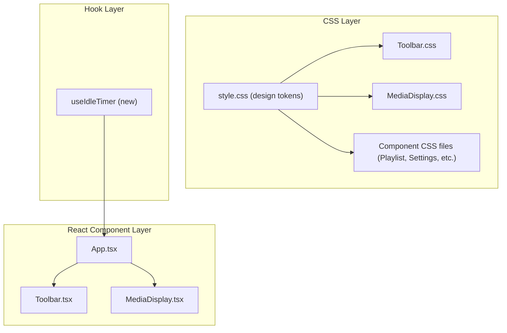

# Design Document: Toolbar UI Improvements

## Overview

This design covers five visual and interaction improvements to the SlideShowBob application:

1. **Toolbar Transparency** — Reduce the glass-bar background opacity by ~20% (from 0.72 to ~0.56) in both dark and light themes while preserving the backdrop blur.
2. **Media Count Repositioning** — Move the `toolbar-count` element from the footer row to an absolutely-positioned overlay in the bottom-right corner of `toolbar-shell`, without altering toolbar dimensions or icon layout.
3. **Low-Contrast Text Fix** — Audit every CSS file for text colors that fail WCAG AA 4.5:1 against their backgrounds, and update hardcoded values (`#666`, `#888`) and the `--text-tertiary` variable to compliant values.
4. **Auto-Hide Toolbar** — Implement a 5-second idle timer (no mouse/keyboard) during slideshow playback that fades the toolbar out and hides the cursor, restoring both on any user input.
5. **Blurred Background Fill** — Render a blurred, cover-scaled duplicate of the current media behind the aspect-fit foreground to replace black letterbox/pillarbox bars.

All changes are CSS-first where possible, with minimal React logic additions for the idle timer and background fill features.

## Architecture

The changes span three layers of the existing architecture:



### Change Mapping

| Requirement | Files Modified | Type |
|---|---|---|
| Req 1: Transparency | `src/style.css` | CSS variable change |
| Req 2: Media Count | `src/components/Toolbar.css`, `src/components/Toolbar.tsx` | CSS + minor JSX restructure |
| Req 3: Contrast Fix | `src/style.css`, `src/components/Toolbar.css`, `src/components/PlaylistWindow.css`, `src/components/SettingsWindow.css`, `src/components/KeyboardShortcutsHelp.css`, `src/components/DiagnosticsPanel.css`, `src/components/ManifestModeDialog.css`, `src/components/ManifestSelectionDialog.css`, `src/components/Toast.css`, `src/components/ProgressIndicator.css` | CSS color updates |
| Req 4: Auto-Hide | `src/hooks/useIdleTimer.ts` (new), `src/App.tsx`, `src/components/Toolbar.tsx` | New hook + integration |
| Req 5: Background Fill | `src/components/MediaDisplay.tsx`, `src/components/MediaDisplay.css` | JSX + CSS additions |

## Components and Interfaces

### Requirement 1: Toolbar Transparency

No new components. Modify the `--glass-bg` CSS variable in `src/style.css`:

- Dark mode: `rgba(28, 28, 30, 0.72)` → `rgba(28, 28, 30, 0.56)`
- Light mode: `rgba(255, 255, 255, 0.72)` → `rgba(255, 255, 255, 0.56)`

The `--glass-bg-elevated` variable (used by modals/menus) remains unchanged to keep dialogs readable.

### Requirement 2: Media Count Repositioning

Modify `Toolbar.tsx` and `Toolbar.css`:

- Make `toolbar-shell` the positioning context (`position: relative` — already `position: fixed`).
- Move `toolbar-count` out of `toolbar-footer` and position it absolutely at `bottom: 0; right: 0` within the shell.
- Remove `toolbar-count` from the flex layout of `toolbar-footer` so the footer only contains `toolbar-status`.
- Apply a small semi-transparent background pill to `toolbar-count` for readability at the new position.

```tsx
// Toolbar.tsx — structural change (simplified)
<div ref={shellRef} className={`toolbar-shell ${hidden ? 'hidden' : ''}`}>
  {/* ... grip, expanded/minimized bar ... */}
  <div className="toolbar-footer">
    <span className="toolbar-status">{statusText}</span>
  </div>
  <span className="toolbar-count">{displayIndex} / {totalCount}</span>
</div>
```

### Requirement 3: Low-Contrast Text Fix

No new components. Systematic CSS updates:

**Global token change** in `src/style.css`:
- `--text-tertiary`: `rgba(255, 255, 255, 0.45)` → `rgba(255, 255, 255, 0.65)` (dark mode)
- `--text-tertiary`: `rgba(0, 0, 0, 0.45)` → `rgba(0, 0, 0, 0.65)` (light mode)

**Hardcoded color replacements** across component CSS files:
- `#666` → `#999` or `var(--text-secondary)` (depending on context)
- `#888` → `#aaa` or `var(--text-secondary)` (depending on context)
- `#aaa` → `#bbb` or `var(--text-secondary)` where needed

Specific elements called out in requirements:
- `.glass-menu-label`, `.glass-menu-value` — use `var(--text-primary)` or a value ≥ 4.5:1
- `.playlist-item-index`, `.playlist-item-type`, `.playlist-grid-index`, `.folder-tree-count`, `.playlist-empty-hint` — replace `#888`/`#666` with compliant values
- `.settings-group-title`, `.settings-action-desc` — replace `#888` with `var(--text-secondary)`
- `.shortcuts-help-footer p`, `.key-separator` — replace `#888`
- `.diagnostics-empty-hint`, `.diagnostics-auto-refresh`, `.diagnostics-event-time` — replace `#666`/`#888`/`#aaa`
- `.manifest-selection-item-count`, `.manifest-dialog-btn-secondary` — replace `#888`
- `.toolbar-status` — already uses `var(--text-tertiary)`, fixed by the token update

### Requirement 4: Auto-Hide Toolbar

New hook: `src/hooks/useIdleTimer.ts`

```typescript
interface UseIdleTimerOptions {
  /** Timeout in milliseconds before idle state triggers */
  timeoutMs: number;
  /** Whether the timer is enabled */
  enabled: boolean;
  /** Callback when idle state is entered */
  onIdle: () => void;
  /** Callback when activity resumes */
  onActive: () => void;
}

interface UseIdleTimerReturn {
  /** Whether the user is currently idle */
  isIdle: boolean;
  /** Manually reset the timer */
  reset: () => void;
  /** Pause the timer (e.g., when a menu is open) */
  pause: () => void;
  /** Resume the timer after pausing */
  resume: () => void;
}

function useIdleTimer(options: UseIdleTimerOptions): UseIdleTimerReturn;
```

Integration in `App.tsx`:
- Enable the timer when `isPlaying === true` and no menus/dialogs are open.
- On idle: set `toolbarVisible = false` and `cursorHidden = true`.
- On active: set `toolbarVisible = true` and `cursorHidden = false`.
- Pause the timer when `showMoreMenu` or `showSortMenu` is true (requires lifting menu state or passing a prop).

The existing `toolbar-shell.hidden` CSS class already handles the fade-out animation (`opacity 0.25s ease, transform 0.25s ease`).

### Requirement 5: Blurred Background Fill

Modify `MediaDisplay.tsx` and `MediaDisplay.css`:

Add a background layer element rendered behind the foreground media inside `.media-display`:

```tsx
// MediaDisplay.tsx — inside the return, before .media-container
{currentMedia && !isAspectMatch && (
  <div className="media-background-fill">
    {currentMedia.type === MediaType.Video && videoSrc ? (
      <video
        src={videoSrc}
        className="background-fill-video"
        autoPlay
        loop
        muted
        playsInline
        ref={bgVideoRef}
      />
    ) : imageSrc ? (
      
    ) : null}
  </div>
)}
```

CSS for the background fill:

```css
.media-background-fill {
  position: absolute;
  inset: 0;
  z-index: 0;
  overflow: hidden;
  pointer-events: none;
}

.media-background-fill img,
.media-background-fill video {
  width: 100%;
  height: 100%;
  object-fit: cover;
  filter: blur(30px) brightness(0.5);
  transform: scale(1.1); /* prevent blur edge artifacts */
}

.media-container {
  position: relative;
  z-index: 1;
}
```

Aspect-match detection: Compare the media's natural aspect ratio to the container's aspect ratio. If they differ by more than a small threshold (e.g., 2%), render the background fill. This is computed in a `useMemo` or `useEffect` that watches container resize and media natural dimensions.

For video sync: The background video element shares the same `src` and uses `autoPlay` + `muted`. A `useEffect` syncs `currentTime` on the background video to the foreground video's `timeupdate` events to keep them in lockstep.

## Data Models

No new data models are introduced. All changes operate on existing state and CSS variables.

The `useIdleTimer` hook uses internal state only (`isIdle: boolean`, timer refs). It does not persist anything.

The background fill feature uses the existing `currentMedia`, `imageSrc`, and `videoSrc` state from `MediaDisplay`. A new boolean `isAspectMatch` is derived from comparing `naturalWidth/naturalHeight` to `containerWidth/containerHeight`.


## Correctness Properties

*A property is a characteristic or behavior that should hold true across all valid executions of a system — essentially, a formal statement about what the system should do. Properties serve as the bridge between human-readable specifications and machine-verifiable correctness guarantees.*

### Property 1: Text contrast meets WCAG AA threshold

*For any* text element in the application that displays on a glass or elevated background, the computed foreground color and computed background color must yield a contrast ratio of at least 4.5:1 as defined by WCAG 2.1 relative luminance formula.

**Validates: Requirements 3.1, 3.2, 3.3, 3.4, 3.5, 3.6, 3.7, 3.8, 3.9**

### Property 2: Idle timer triggers after timeout with no activity

*For any* positive timeout value and any sequence of events where no mouse or keyboard input occurs for at least that duration, the idle timer hook shall report `isIdle === true`.

**Validates: Requirements 4.1**

### Property 3: Any user input resets idle state

*For any* idle state (where `isIdle === true`), dispatching any mouse movement event or any keyboard event shall cause the idle timer to transition to `isIdle === false` and restart the countdown from zero.

**Validates: Requirements 4.2, 4.3, 4.4**

### Property 4: Disabled timer never reports idle

*For any* configuration where the idle timer is disabled (`enabled === false`), the hook shall never transition to `isIdle === true`, regardless of elapsed time without user input.

**Validates: Requirements 4.5, 4.8**

### Property 5: Paused timer does not trigger idle

*For any* configuration where the idle timer is paused, the hook shall not transition to `isIdle === true` regardless of elapsed time, and shall resume counting from where it left off when unpaused.

**Validates: Requirements 4.6**

### Property 6: Aspect-match detection controls background fill rendering

*For any* pair of (media natural dimensions, container dimensions), the background fill shall render if and only if the aspect ratios differ by more than the threshold. Equivalently: `abs(mediaAspect - containerAspect) > threshold` implies background fill is shown, and `abs(mediaAspect - containerAspect) <= threshold` implies background fill is not shown.

**Validates: Requirements 5.1, 5.9**

## Error Handling

### Requirement 1 (Transparency)
- No error conditions. CSS variable changes are static.

### Requirement 2 (Media Count Repositioning)
- No error conditions. Layout is CSS-only.

### Requirement 3 (Contrast Fix)
- No runtime errors. All changes are static CSS values.
- If a CSS variable is overridden by a user agent stylesheet, the fallback values in each `var()` call should also meet contrast requirements.

### Requirement 4 (Auto-Hide Toolbar)
- **Timer cleanup**: The `useIdleTimer` hook must clear all `setTimeout` handles on unmount and when `enabled` changes to `false`, to prevent memory leaks and stale callbacks.
- **Rapid toggle**: If `isPlaying` toggles rapidly, the hook must not accumulate multiple timers. Each enable/disable cycle must cancel the previous timer before starting a new one.
- **Event listener cleanup**: Mouse and keyboard event listeners must be removed when the hook is disabled or the component unmounts.

### Requirement 5 (Blurred Background Fill)
- **Missing media source**: If `imageSrc` or `videoSrc` is null/undefined, the background fill element must not render (guarded by conditional rendering).
- **Video sync errors**: If the background video fails to load or play, it should fail silently (muted, no controls) without affecting the foreground media. An `onError` handler on the background video should log the error but not trigger user-facing error toasts.
- **Canvas GIF**: For GIF media rendered via canvas, the background fill should use the static `imageSrc` (first frame) rather than attempting to duplicate the canvas player, to avoid complexity and performance issues.
- **Performance**: The background fill uses CSS `filter: blur()` which is GPU-accelerated. The `transform: scale(1.1)` prevents blur edge artifacts. No additional JavaScript computation is needed per frame.

## Testing Strategy

### Testing Framework

- **Unit / Integration tests**: Vitest (already configured in the project)
- **Property-based tests**: `fast-check` library for Vitest
- **DOM testing**: `@testing-library/react` (already installed)

### Dual Testing Approach

Both unit tests and property-based tests are required:

- **Unit tests** cover specific examples, edge cases, and integration points (e.g., "toolbar hides after exactly 5 seconds", "background fill renders for a 16:9 image in a 4:3 container").
- **Property-based tests** cover universal properties across randomized inputs (e.g., "for any text color pair, contrast ratio meets threshold", "for any timeout and activity pattern, idle state is correct").

### Property-Based Testing Configuration

- Library: `fast-check` (npm package `fast-check`)
- Minimum iterations: 100 per property test
- Each property test must include a comment referencing the design property:
  ```
  // Feature: toolbar-ui-improvements, Property N: <property text>
  ```
- Each correctness property is implemented by a single property-based test

### Test Plan

| Property | Test Type | What to Test |
|---|---|---|
| Property 1: Text contrast | Property (fast-check) | Generate random foreground/background color pairs from the app's palette, compute WCAG contrast ratio, assert ≥ 4.5:1 |
| Property 2: Idle timer triggers | Property (fast-check) | Generate random timeout values, simulate no-activity periods, assert isIdle transitions |
| Property 3: Input resets idle | Property (fast-check) | Generate random event types (mousemove, keydown), dispatch while idle, assert isIdle resets |
| Property 4: Disabled timer | Property (fast-check) | Generate random timeout values with enabled=false, assert isIdle never becomes true |
| Property 5: Paused timer | Property (fast-check) | Generate random pause/resume sequences, assert idle does not trigger while paused |
| Property 6: Aspect-match detection | Property (fast-check) | Generate random media and container dimension pairs, assert background fill rendering matches aspect ratio comparison |

### Unit Test Coverage

- Toolbar transparency: Verify CSS variable values in dark and light mode
- Media count position: Render toolbar, assert `toolbar-count` has absolute positioning
- Media count in minimized state: Render minimized toolbar, assert count is visible
- Background fill source match: Render with mismatched aspect ratio, assert background src === foreground src
- Background fill pointer-events: Assert background fill has `pointer-events: none`
- Video sync: Assert background video src matches foreground video src
- Auto-hide animation: Assert `toolbar-shell.hidden` class has correct transition properties
