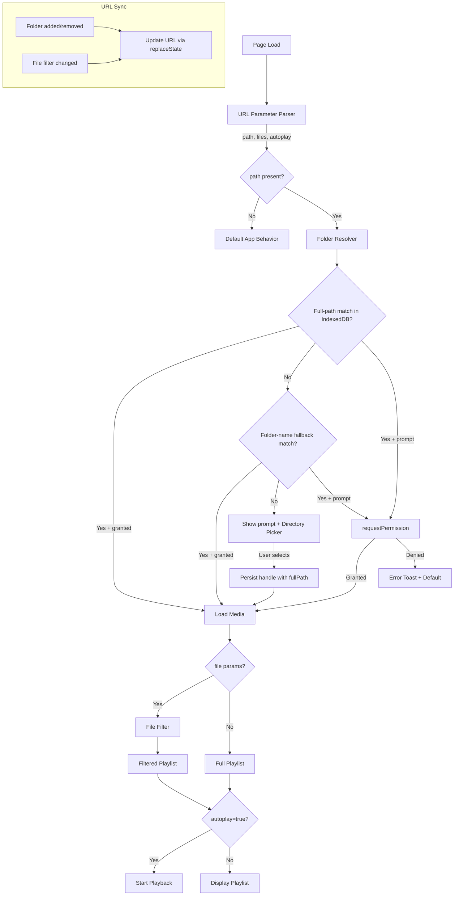

# Design Document: URL Path Parameters

## Overview

This feature adds URL parameter support to SlideShowBob, allowing users to bookmark or share URLs that specify a full filesystem path and optional file filters. When the app loads with a `path` query parameter, it attempts to resolve the folder from persisted IndexedDB handles (two-tier matching: full path first, then folder-name fallback) or prompts the user to grant access. Optional `file` parameters filter the playlist to specific items, and `autoplay=true` enables hands-free kiosk-style playback.

The design introduces three new modules:
- **URL Parameter Parser** — extracts, validates, and decodes URL search parameters
- **Folder Resolver** — matches parsed path to persisted handles or triggers directory picker
- **File Filter** — reduces loaded media to the specified subset in URL-defined order

A key design decision is storing the **full filesystem path** alongside each directory handle in IndexedDB. This enables reliable matching across sessions since folder names alone can be ambiguous (multiple folders named "Photos" on different paths).

## Architecture



## Components and Interfaces

### URL Parameter Parser

A pure, synchronous module that extracts parameters from `window.location.search`.

```typescript
interface ParsedUrlParams {
  /** Full filesystem path from ?path= parameter, or null if absent/invalid */
  path: string | null;
  /** Ordered, deduplicated list of file names from ?file= parameters */
  files: string[];
  /** Whether autoplay=true was specified */
  autoplay: boolean;
  /** Warnings generated during parsing (e.g., rejected file entries) */
  warnings: string[];
  /** Whether an error occurred that should block further processing */
  error: string | null;
}

function parseUrlParams(searchString: string): ParsedUrlParams;
```

**Validation rules:**
- Path: reject if empty/whitespace-only after decoding, or if it contains `..` path segments (or percent-encoded equivalents)
- File names: reject entries containing `/` or `\`, entries exceeding 255 characters, or empty values
- File list: deduplicate preserving first-occurrence order, cap at 100 entries
- File params without path: ignored entirely

### Folder Resolver

An async module that resolves a parsed path to a usable `FileSystemDirectoryHandle`.

```typescript
interface FolderResolution {
  handle: FileSystemDirectoryHandle;
  folderName: string;
  fullPath: string;
  source: 'fullPath' | 'folderName' | 'picker';
}

interface FolderResolverOptions {
  path: string;
  onStatusChange: (message: string) => void;
  onPromptUser: (message: string) => void;
}

async function resolveFolder(options: FolderResolverOptions): Promise<FolderResolution>;
```

**Two-tier matching logic:**
1. Query IndexedDB for a record where `fullPath === path` — if found with granted permission, use it
2. Extract last path segment (`path.split('/').pop()` or similar) and query IndexedDB for a record where `folderName === lastSegment` — if found with granted permission, use it
3. If a match is found at either tier but permission is `"prompt"`, call `requestPermission({ mode: 'read' })`
4. If no match at all, show a message: *"This URL wants to open [full path] — please select this folder"* and open the directory picker

### File Filter

A pure, synchronous module that filters and orders media items.

```typescript
interface FilterResult {
  matched: MediaItem[];
  missing: string[];
}

function filterMediaByFileList(
  mediaItems: MediaItem[],
  fileList: string[]
): FilterResult;
```

**Filtering rules:**
- Compare `mediaItem.fileName` against each entry in `fileList` (case-insensitive)
- Output order follows `fileList` order
- If a file name matches multiple items (same name in different subfolders), include all at that position
- Duplicate entries in `fileList` produce matches only at the first occurrence position

### URL Sync

Updates the browser URL to reflect current app state without triggering navigation.

```typescript
interface UrlSyncState {
  path: string | null;
  files: string[];
}

function syncUrlToState(state: UrlSyncState): void;
```

- Uses `history.replaceState` (no new history entries)
- Percent-encodes path and file values for URL safety
- Removes all slideshow params when state is empty

### IndexedDB Schema (updated)

The existing `directoryHandles` object store is upgraded to include an optional `fullPath` field.

```typescript
interface DirectoryHandleRecord {
  /** Primary key: folder name (handle.name) — preserved for backward compat */
  folderName: string;
  /** The stored FileSystemDirectoryHandle (structured-cloneable) */
  handle: FileSystemDirectoryHandle;
  /** Timestamp of when this record was saved */
  timestamp: number;
  /** Full filesystem path, if known. Used as primary matching key for URL resolution. */
  fullPath?: string;
}
```

- A new index on `fullPath` enables efficient lookups by full path
- Existing records without `fullPath` continue to work (matched by `folderName` only)
- The DB version is bumped to 2 in the `onupgradeneeded` handler to add the new index

## Data Models

### URL Parameter Flow

```
URL: ?path=/Users/jeff/Pictures/Vacation%20Photos&file=sunset.jpg&file=beach.png&autoplay=true

ParsedUrlParams:
  path: "/Users/jeff/Pictures/Vacation Photos"
  files: ["sunset.jpg", "beach.png"]
  autoplay: true
  warnings: []
  error: null
```

### IndexedDB Records

**New-format record (full path known):**
```json
{
  "folderName": "Vacation Photos",
  "handle": "<FileSystemDirectoryHandle>",
  "timestamp": 1719000000000,
  "fullPath": "/Users/jeff/Pictures/Vacation Photos"
}
```

**Legacy record (no full path):**
```json
{
  "folderName": "Vacation Photos",
  "handle": "<FileSystemDirectoryHandle>",
  "timestamp": 1718000000000
}
```

### Matching Priority

| URL path | IndexedDB has fullPath match | IndexedDB has folderName match | Result |
|----------|------------------------------|-------------------------------|--------|
| `/Users/jeff/Pictures/Vacation Photos` | Yes (granted) | — | Use handle directly |
| `/Users/jeff/Pictures/Vacation Photos` | Yes (prompt) | — | Call requestPermission |
| `/Users/jeff/Pictures/Vacation Photos` | No | Yes (granted) | Use folder-name handle |
| `/Users/jeff/Pictures/Vacation Photos` | No | Yes (prompt) | Call requestPermission |
| `/Users/jeff/Pictures/Vacation Photos` | No | No | Show picker prompt |

## Correctness Properties

*A property is a characteristic or behavior that should hold true across all valid executions of a system — essentially, a formal statement about what the system should do. Properties serve as the bridge between human-readable specifications and machine-verifiable correctness guarantees.*

### Property 1: Path parameter round-trip

*For any* valid filesystem path string (non-empty, non-whitespace, no path traversal), writing it to a URL via `syncUrlToState` and then parsing it back via `parseUrlParams` SHALL produce the original path string.

**Validates: Requirements 1.1, 1.2, 1.3, 7.1, 7.6**

### Property 2: File parameter round-trip

*For any* ordered list of valid file names (non-empty, no path separators, ≤255 chars, deduplicated), writing them to a URL via `syncUrlToState` and then parsing back via `parseUrlParams` SHALL produce the same ordered list.

**Validates: Requirements 2.1, 2.3, 2.6, 7.3, 7.6**

### Property 3: File filter correctness

*For any* set of media items and *any* list of filter file names, the output of `filterMediaByFileList` SHALL contain only items whose `fileName` matches an entry in the filter list (case-insensitive comparison), and SHALL contain no items whose `fileName` does not match any filter entry.

**Validates: Requirements 4.1, 4.5**

### Property 4: File filter ordering

*For any* set of media items and *any* ordered list of filter file names (with possible duplicates), the matched output SHALL be ordered according to the first-occurrence position of each file name in the filter list, with items matching the same filter entry grouped together at that position.

**Validates: Requirements 4.2, 4.7**

### Property 5: File filter includes all subfolder matches

*For any* set of media items where multiple items share the same `fileName` (in different relative paths), filtering by that file name SHALL include all such items in the result.

**Validates: Requirements 4.6**

### Property 6: Path traversal rejection

*For any* path string containing a `..` segment (e.g., `foo/../bar`, `/Users/../etc/passwd`), `parseUrlParams` SHALL return `error` as non-null and `path` as null, regardless of where the traversal sequence appears in the path.

**Validates: Requirements 6.1**

### Property 7: File name validation

*For any* string containing a forward slash `/` or backslash `\`, OR *any* string exceeding 255 characters, `parseUrlParams` SHALL exclude it from the returned `files` list and include a warning.

**Validates: Requirements 6.2, 6.3**

## Error Handling

| Scenario | Behavior | User Feedback |
|----------|----------|---------------|
| Invalid path (traversal) | Discard path + files, load default | Error toast: "Invalid path in URL" |
| Invalid file entry (separator or too long) | Exclude that entry, continue with rest | Warning toast listing rejected entries |
| Permission denied by user | Abort folder load, fall back to default | Error toast: "Access denied for [path]" |
| IndexedDB unavailable | Skip persistence, use in-memory only | Warning toast on first occurrence |
| No media found after filtering | Show empty state | Warning toast listing missing files |
| Unexpected parse error | Fall back to default behavior | Error toast: "Could not process URL parameters" |
| Network/browser API error during picker | Abort, fall back to default | Error toast with generic message |

**Error recovery strategy:**
- All errors are non-fatal — the app always falls back to its default state (no folder selected)
- Errors during URL parsing never prevent the app from loading
- IndexedDB failures are gracefully degraded (in-memory operation continues)
- Permission errors are surfaced clearly so the user knows to re-grant access

## Testing Strategy

### Property-Based Tests (fast-check)

The project already uses `fast-check` (v4.7.0). Property tests will target the pure functions:

- **URL Parameter Parser** (`parseUrlParams`): round-trip properties, validation properties
- **File Filter** (`filterMediaByFileList`): filtering, ordering, deduplication properties
- **URL Sync** (`syncUrlToState` → `parseUrlParams` round-trip)

Configuration:
- Minimum 100 iterations per property
- Each test tagged with: `Feature: url-path-parameters, Property {N}: {description}`

### Unit Tests (example-based)

- Parser handles edge cases: multiple `path` params (uses first), file params without path (ignored), all-empty file params (no filter)
- Autoplay parameter: absent, "true", "false", other values
- Folder Resolver: specific mock scenarios for each tier of matching
- URL Sync: replaceState called (not pushState), params removed when folders cleared

### Integration Tests

- Full flow: URL with path → IndexedDB lookup → permission check → media load → filter → playlist
- IndexedDB schema migration: old records (no fullPath) still load correctly
- Two-tier matching: full-path match takes precedence over folder-name match
- Directory picker flow when no handle matches

### Generators (for property tests)

```typescript
// Path generator: valid filesystem paths
const validPath = fc.array(fc.stringOf(fc.char().filter(c => c !== '/' && c !== '\\' && c !== '\0'), { minLength: 1 }), { minLength: 1, maxLength: 8 })
  .map(segments => '/' + segments.join('/'));

// File name generator: valid file names (no separators, ≤255 chars)
const validFileName = fc.stringOf(
  fc.char().filter(c => c !== '/' && c !== '\\' && c !== '\0'),
  { minLength: 1, maxLength: 255 }
);

// Media item generator
const mediaItem = fc.record({
  filePath: fc.string(),
  fileName: validFileName,
  type: fc.constantFrom('Image', 'Gif', 'Video'),
  folderName: fc.string(),
  relativePath: fc.string(),
});
```
